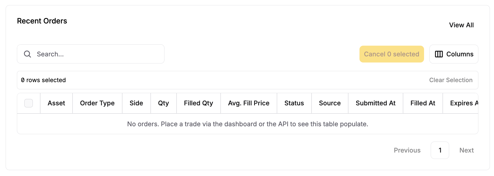
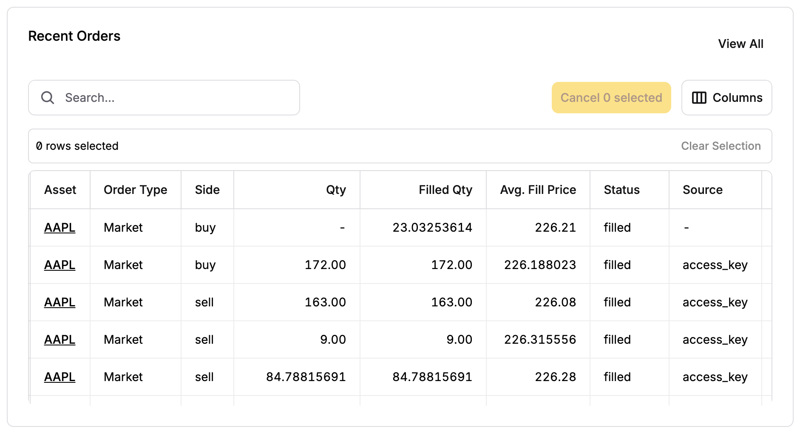
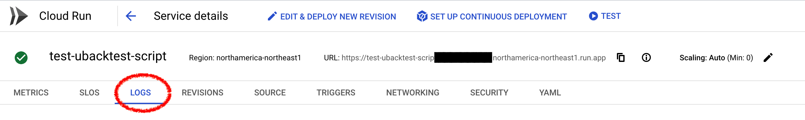
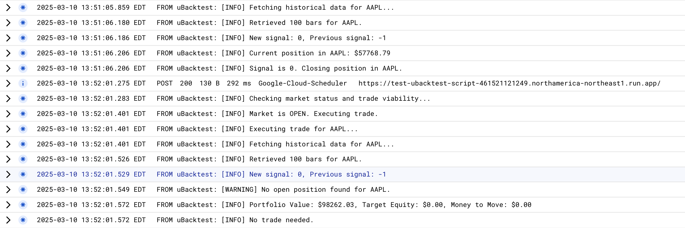

### Monitoring via Alpaca

To stay updated on your trading algorithms, you can monitor the **Alpaca dashboard**. While the dashboard provides a good overview of your trades, it won't show details about errors or edge cases. For that, you’ll need to refer to the **Cloud Logs** for more comprehensive information.

You can view your recent trades directly on the main Alpaca dashboard, under **Recent Orders**:

After you've placed a couple trades, algorithmically or otherwise, you will start to see those trades populate the dashboard:

---

### Monitoring via Google Cloud Logs

On the homepage of your cloud-deployed script, navigate to the **Logs** tab. 

Here, you’ll find a series of logs related to your function’s execution and trading activity.

**uBacktest** attempts to track detailed information, including:
- Errors and warnings
- Descriptions of executed trades
- Updates on equity, portfolio, and cash balances

Here’s an example of Google Cloud logs:

_Notice the log entries related to buy/sell signals, as well as additional info and warnings. These details are helpful for tweaking your strategy based on real-time feedback._