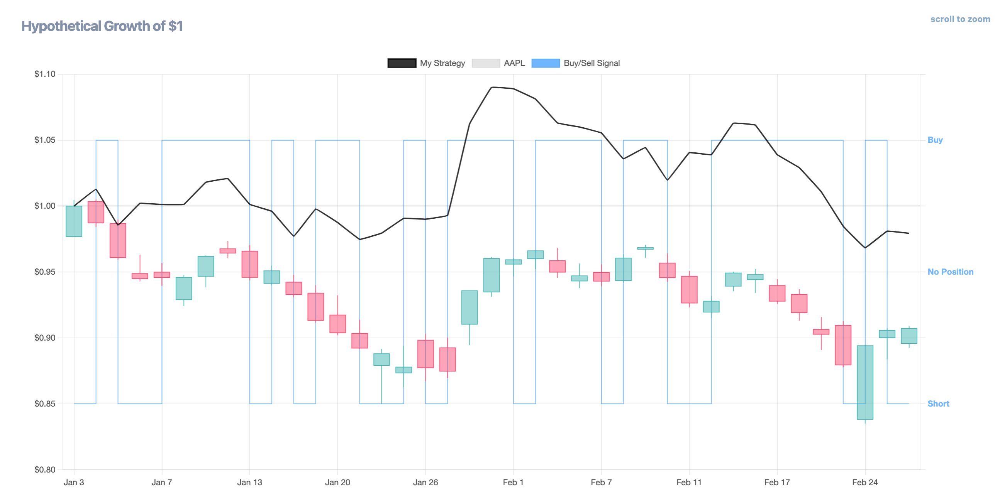

# Deploy Your Trading Strategy in 7 Easy Steps

This guide will walk you through taking a backtested strategy and deploying it live with Alpaca and AWS Lambda. Follow these simple steps to get started!

Don't let AWS intimidate you—we'll walk you through deploying your script step by step, without the hassle of navigating its complexities.

---

### 1. Generate Code

1. Go to your strategy's page.
2. Scroll down to the **Deployment** section.  
   __
3. Fill in the required fields to match your successful backtest.
4. Click **Generate Code**—your trading strategy will now appear in the editor!

Take a moment to appreciate that your strategy is ready to transition from simulation to the real market.

:::caution  
Ensure your strategy is fully tested—any unresolved bugs or logic gaps will carry over to the new script.  
:::

---

### 2. Create an Alpaca Account

We use [Alpaca](https://alpaca.markets/) to execute trades with no commission fees. They offer a well-maintained Python API for easy trade execution.

1. Sign up for a free Alpaca account [here](https://app.alpaca.markets/signup).
2. Log in and go to the **Paper Trading** dashboard.
3. You’ll see $100,000 in virtual funds—perfect for testing!
4. Copy your **API Key** and **Secret Key** to a safe location.

---

### 3. Add Your API Keys to the Code

Your generated script needs your Alpaca credentials to place trades.

1. Open the generated script in the editor.
2. Replace the placeholder API keys with the ones from your Alpaca account.

This step ensures security by keeping your credentials private.

---

### 4. Create an AWS Account

To automate script execution, we’ll use [AWS Lambda](https://aws.amazon.com/lambda/), which offers a **free tier**. 

1. Sign up for a free AWS account [here](https://aws.amazon.com/free/).
2. AWS may ask for a credit card, but this tutorial stays within the free tier.

---

### 5. Deploy Your Code to AWS Lambda

1. Go to the [AWS Lambda Console](https://console.aws.amazon.com/lambda/home).
2. Click **Create Function**.
3. Select **Author from Scratch**.
4. Name your function and choose **Python 3.xx** as the runtime.
5. Copy and paste your strategy code into the AWS Lambda editor.
6. Click **Deploy** to save your function.

---

### 6. Schedule Automated Execution

We use [Amazon EventBridge](https://aws.amazon.com/eventbridge/) to run your strategy automatically.

1. Go to the [Amazon EventBridge Console](https://console.aws.amazon.com/events/home).
2. Click **Create Rule** and set up a **Cron Job** that matches your strategy’s trading frequency.
3. Use the following examples for scheduling:
   - **Daily Execution (1d):** `0 0 * * ? *`
   - **Every 1 Minute:** `rate(1 minute)`
   - **Every Hour:** `rate(1 hour)`

---

### 7. Monitor Your Strategy in Action

- Check your trades directly in [Alpaca](https://app.alpaca.markets/).
- View timestamped logs in AWS Lambda’s **Monitor** tab.

That’s it! Your strategy is now live and running on autopilot.

🚀 Happy Trading!

