# Deploy Your Trading Strategy in 8 Easy Steps

This guide will help you deploy your backtested trading strategy live with Alpaca and Google Cloud. We’ll walk you through each step, making sure everything is simple and clear.

---

### 1. Create an Alpaca Account

We use [Alpaca](https://alpaca.markets/) for commission-free trade execution with a well-maintained Python API.

1. Sign up for a free account [here](https://app.alpaca.markets/signup).
2. Log in and go to the **Paper Trading** dashboard.
3. Allocate simulated funds (e.g., $100,000) for testing. You can have up to 3 free paper trading accounts.

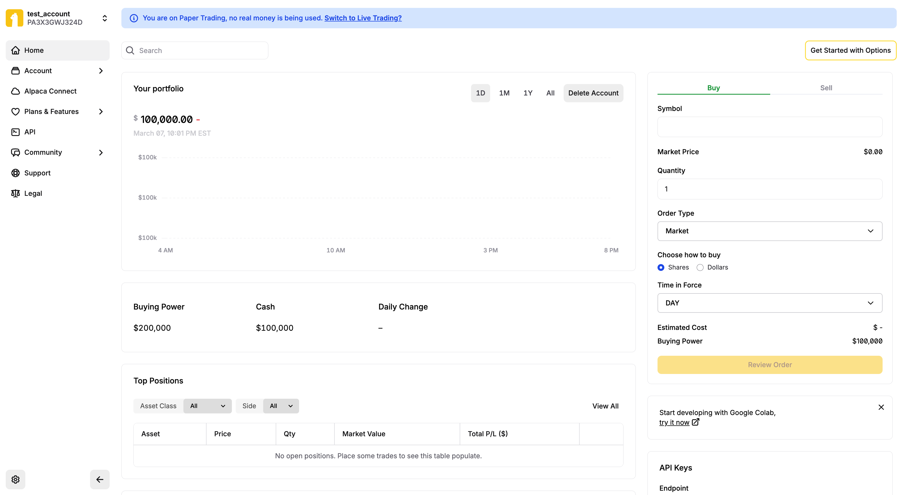

4. Generate/Regenerate your **API Key** and **Secret Key**.

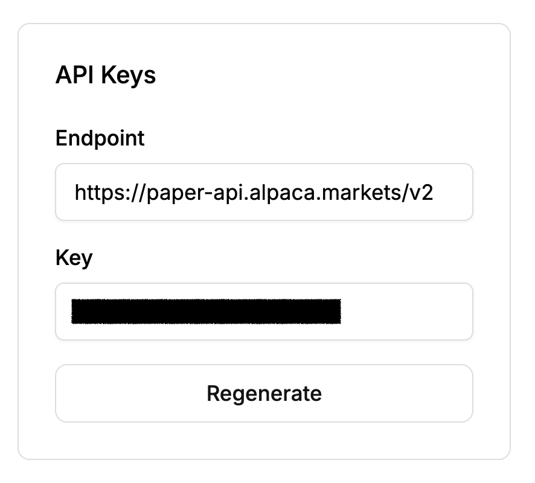

---

### 2. Generate Code for Deployment

Once your strategy is backtested, you can generate the deployment code.

1. Go to the strategy's page on [uBacktest.com](https://uBacktest.com).
2. Scroll to the **Deployment** section.

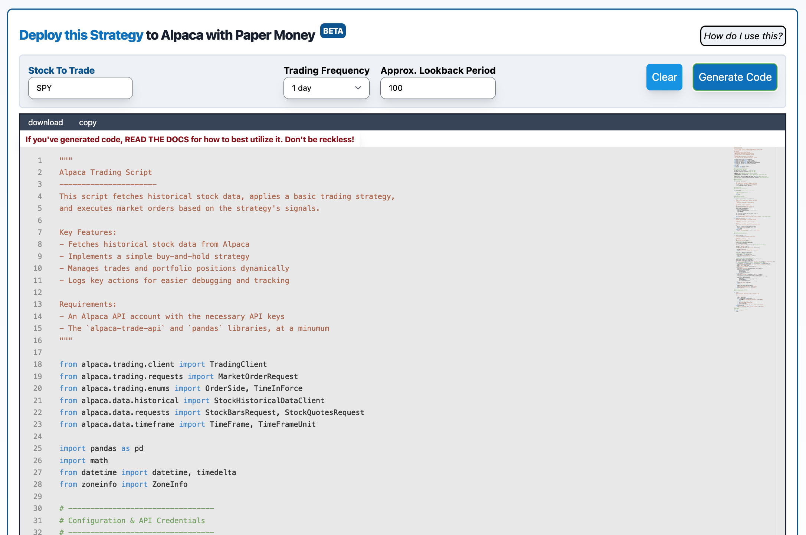

3. Fill in the required fields to match your backtest. Make a mental note of your trading frequency, as we will schedule the script to run at this interval later.
4. Click **Generate Code**—your strategy code will appear in the editor! You will also need this code later.

:::caution  
Ensure your strategy is fully tested, as any unresolved bugs or gaps in logic will carry over into the deployment script.  
:::

---

### 3. Create a Google Cloud Account

Create a Google Cloud account or log in with your existing Google account.

1. Go to [Google Cloud](https://cloud.google.com/) and log in.
2. Access the **Console**:

3. Search for **Cloud Run** and select **Cloud Run functions**:

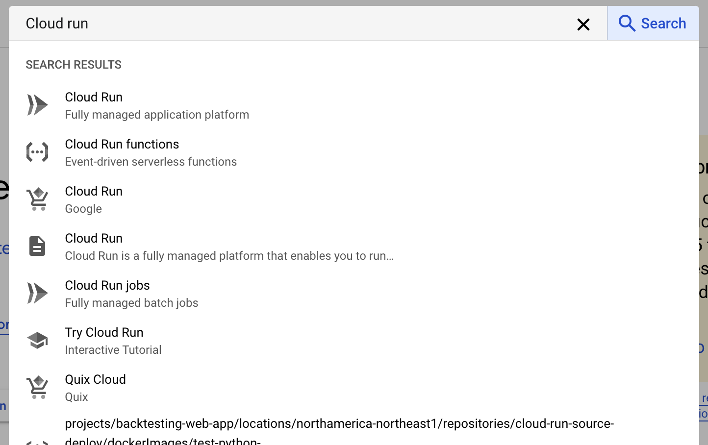

---

### 4. Create a Cloud Function

In Google Cloud, you’ll create a function to run your trading strategy.

1. Click on **WRITE A FUNCTION**.

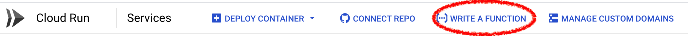

2. Name the function (e.g., `test-ubacktest-script`).
3. Select a **Region** somewhat near you.
3. Select **Python 3.12** for the runtime.
4. Set **Authentication** to **Require Authentication** (optional but recommended).
5. Click **Create** to set up the function.

_here's what this may look like:_
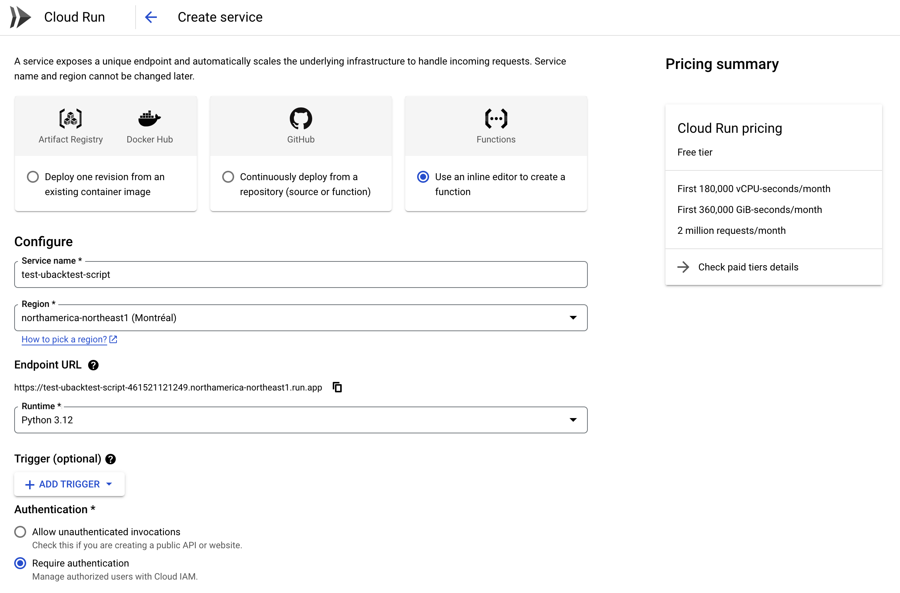

---

### 5. Insert Your Generated Code

After you've created the function, it is time to make it your own!

1. Go to the **Source Code** section. For now, you will see some introductory/placeholder code like this:

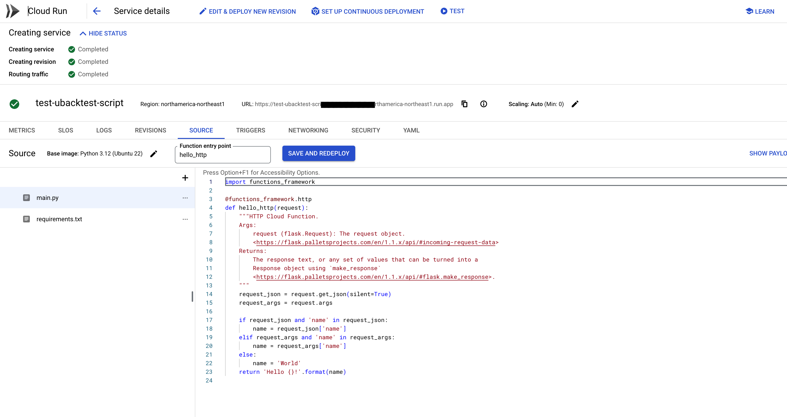

2. Delete this filler code. Paste your generated strategy code:

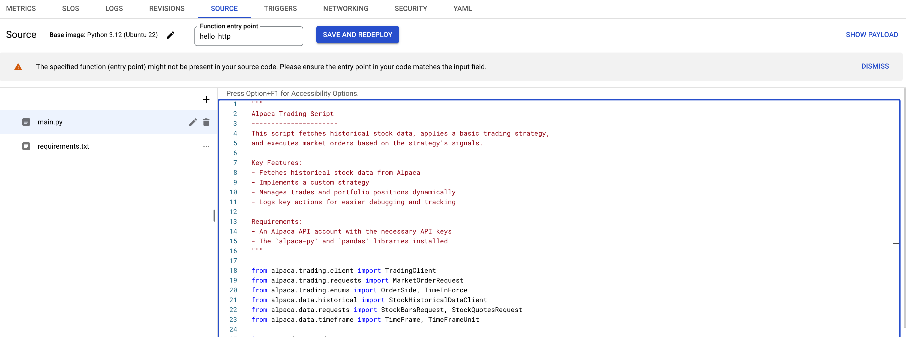

3. In the **requirements.txt** file, add all your dependencies:

   - functions-framework
   - pandas
   - alpaca-py
   - numpy
   - _(& other required libraries)_

:::danger
Your code will not run if you don't include at least **functions-framework**, **pandas**, and **alpaca-py**. Better to be safe than sorry and include all packages you think you may be using in addition to these.
:::

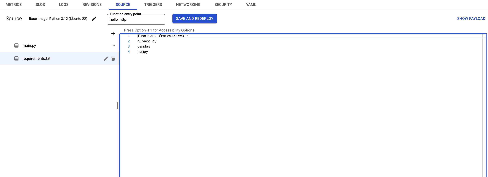

4. After adding the code and dependencies, click **SAVE AND REDEPLOY**. It may take a little while, but your strategy should have a little green check, indicating success!

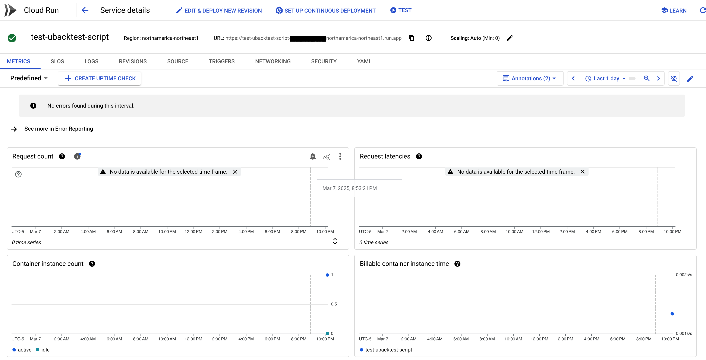

---

### 6. Set Environment Variables

Your strategy will need to use your Alpaca API Keys. Let’s set these up securely.

1. Click **Edit & Deploy New Revision**. See the previous image; this button is found at the top of your function's home page.
2. Scroll down and select **Variables & Secrets**.
3. Paste your **API_KEY** and **API_SECRET** as environment variables.

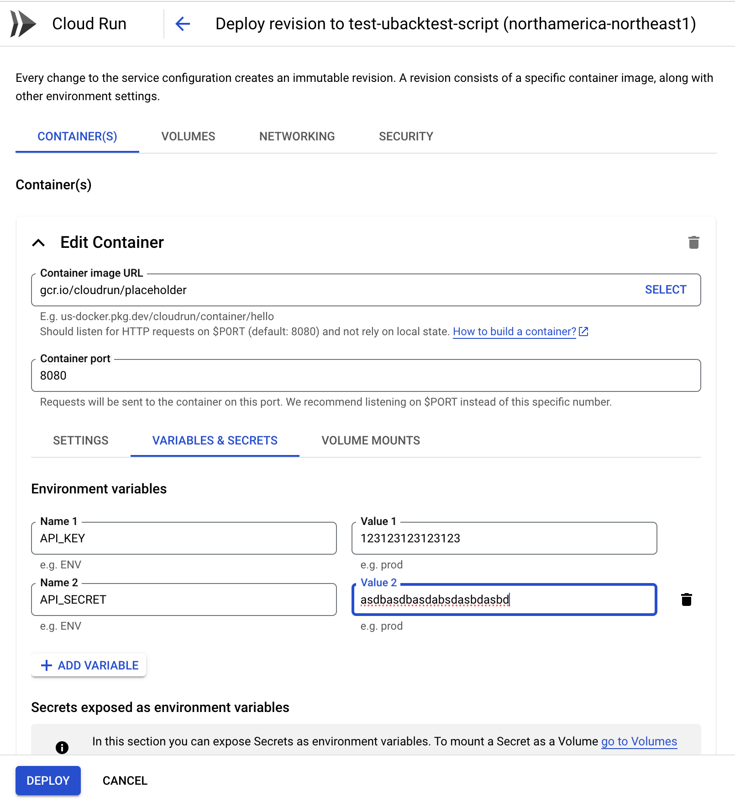

4. Click **Deploy**.

---

### 7. Restrict Access to Your Script  

By default, _anyone can execute_ your endpoint. 
If you're using paper trading, you can skip this step. However, it's strongly recommended (and often required) to restrict access to your script.  
To do this, you'll grant **Cloud Run Invoker** privileges to yourself.  

1. Open the Service Accounts Page  
Search for **"Service Accounts"** in the search bar:  

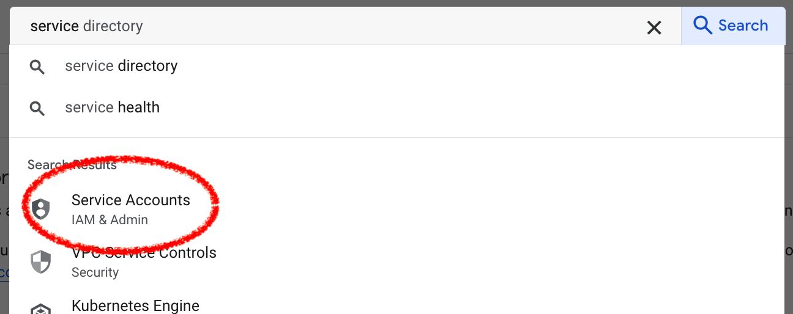  

2. Create a New Service Account  
Click **"Create Service Account"**:  

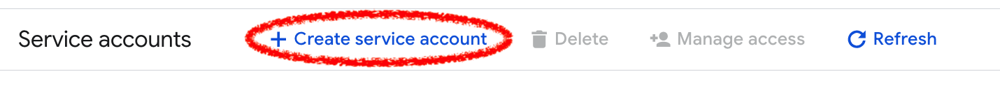  

3. Name Your Service Account  
Give it a name like `cloud-run-invoker`:  

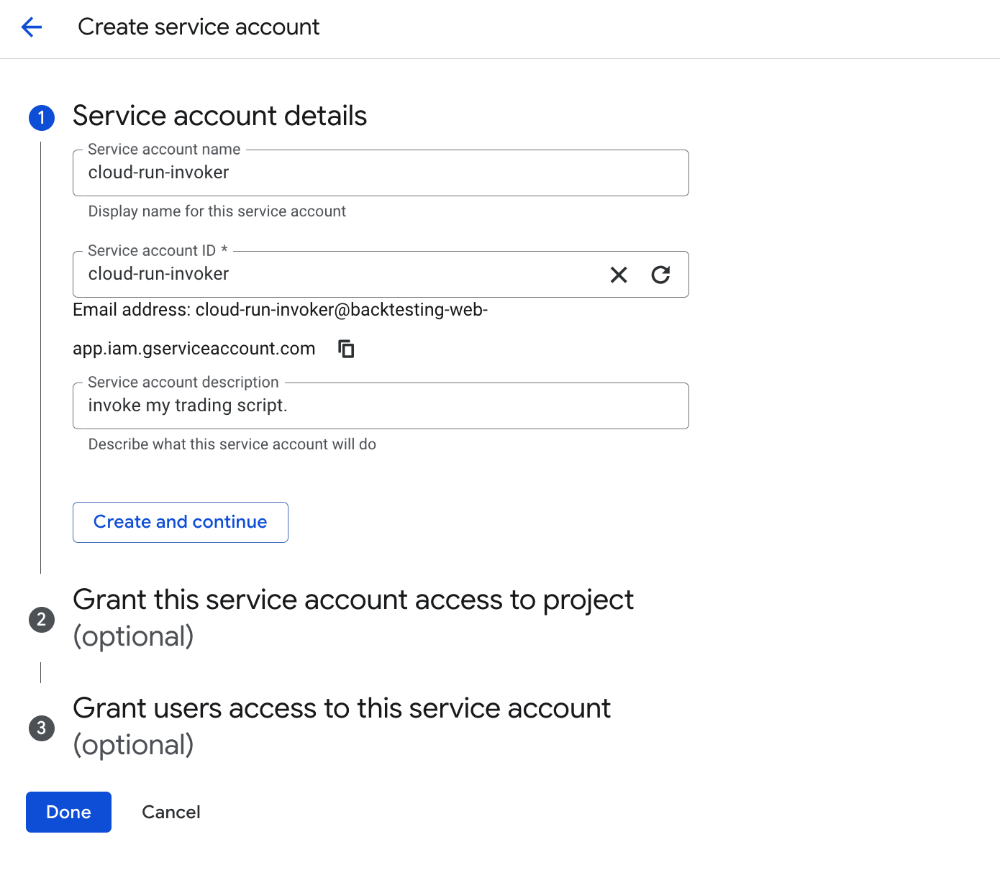  

4. Assign the Cloud Run Invoker Role  
Click **Create and Continue**. Under **"Grant this service account access to project"**, add a new role and search for **Cloud Run Invoker**:  

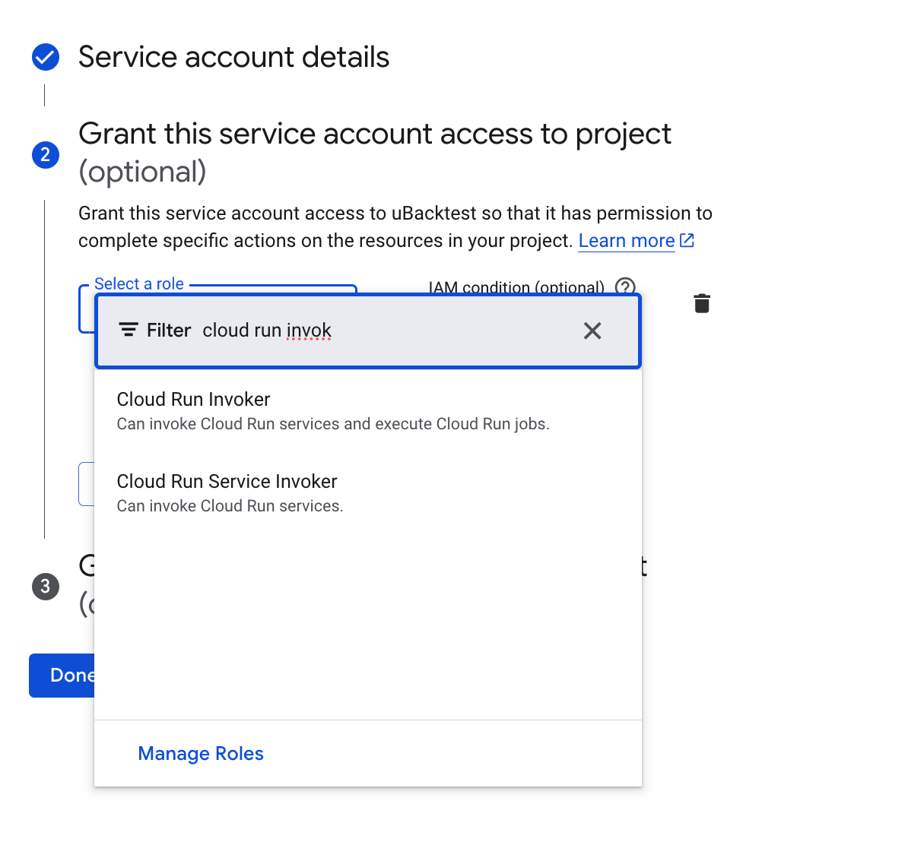  

5. Finalize Setup  
Click through the remaining prompts— no further steps are needed! Your script is now restricted to your account.

---

### 8. Set a Scheduler with Cloud Scheduler

To run your strategy on a schedule, use Google Cloud Scheduler.

**Steps:**
1. Search for **Cloud Scheduler** in the console.

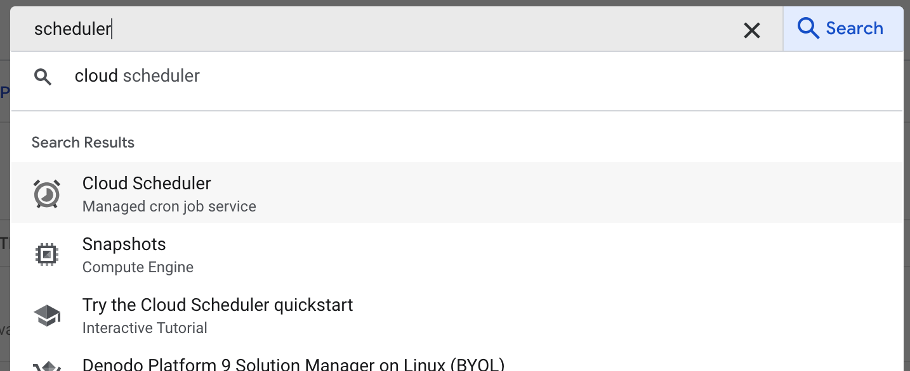

2. Click **SCHEDULE A JOB**:

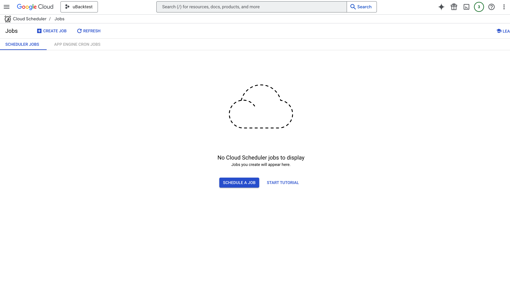

3. Fill in the job details:

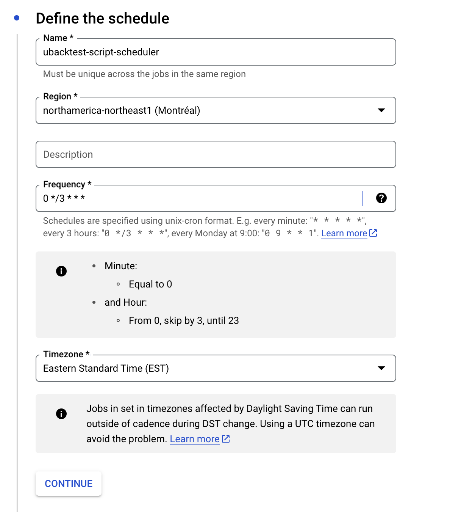

- **Name**: Choose a name (e.g., `ubacktest-scheduler`).
- **Frequency**: Set the frequency. 

:::tip[Here’s a quick guide to common cron-style frequency formats:]
- **`* * * * *`**: Every minute
- **`*/5 * * * *`**: Every 5 minutes
- **`*/15 * * * *`**: Every 15 minutes
- **`*/30 * * * *`**: Every 30 minutes
- **`0 * * * *`**: Every hour on the hour
- **`0 */3 * * *`**: Every 3 hours on the hour
___
- **`0 16 * * *`**: Daily at 4:00 PM
- **`59 15 * * *`**: Daily at 3:59 PM (more realistic to market conditions)
:::

This frequency must match that of the frequency you specified when generating code!

- **Target**: Choose **HTTP** and enter your function’s URL. Your Cloud Run Function's URL can be found at the top of its home page:

4. Set API Permissions:

To ensure your API is accessible only to you— which is highly recommended— configure the authorization settings to make the service **private**.  
- In the **Auth Header** section, click **"Add OIDC Token"**:  

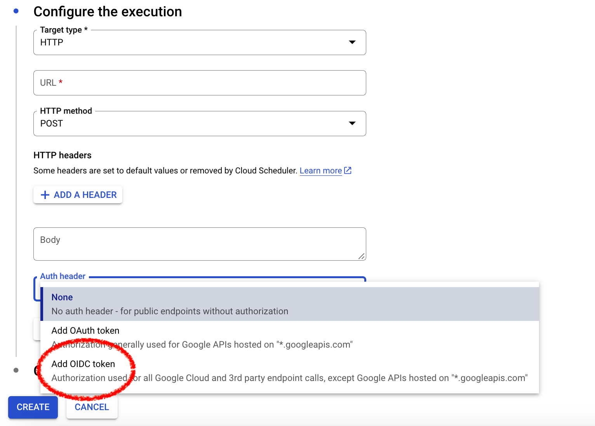  

- For the first dropdown, select the **Cloud Run Invoker** service account you created earlier.  
- In the second field, enter your function’s URL, which should match the **HTTP** URL listed above:

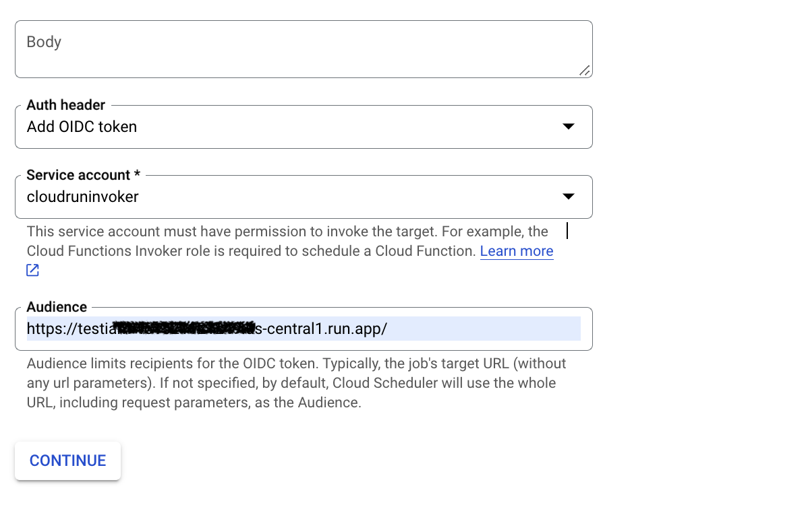

5. Click **Continue, then Create** to save the schedule:

---

# That's it! Your Strategy is Live!

By following these 8 steps, your trading strategy will be live on Alpaca and Google Cloud. 

[On the next page](/deployment/monitor), we will show you how to and make adjustments as needed to optimize your real-world trading!