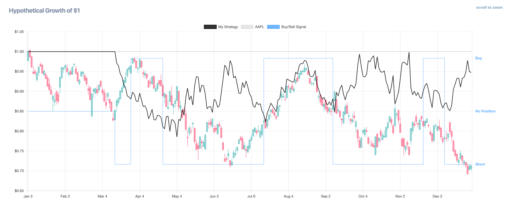
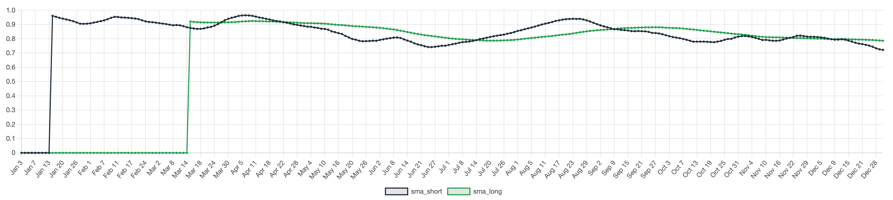

We figure it is good to provide an example with a little more legitimacy than the random [introductory strategy](./simplewalkthrough). So, here you go.

### Introduction  

This second guide walks you through a basic yet powerful trading strategy: the **Simple Moving Average (SMA) Crossover**. By following along, you’ll get familiar with the backtesting framework while building a strategy that traders actually use in real markets.  

### The Example Strategy  

Our strategy will use two simple moving averages:  

- **Short-term SMA (e.g., 10-day)** – Captures recent price trends.  
- **Long-term SMA (e.g., 50-day)** – Represents the broader trend.  

#### Trading Rules  
- **Buy (1):** When the short-term SMA crosses **above** the long-term SMA (bullish crossover).  
- **Short (-1):** When the short-term SMA crosses **below** the long-term SMA (bearish crossover).  

This approach helps us ride upward trends and bet against the asset when momentum weakens or reverses.  

### Strategy Code  

```python title="smaCrossover.py"
'''
Simple Moving Average Crossover Strategy

Generates buy/short signals based on two SMAs.
'''

import pandas as pd

def strategy(data, short_window=10, long_window=50):
    data['SMA_short'] = data['close'].rolling(window=short_window).mean()
    data['SMA_long'] = data['close'].rolling(window=long_window).mean()
    
    data['signal'] = 0  # Default to hold  
    data.loc[data['SMA_short'] > data['SMA_long'], 'signal'] = 1  # Buy
    data.loc[data['SMA_short'] < data['SMA_long'], 'signal'] = -1  # Short  
    
    return data
```

### Understanding the Strategy Code  

Like all trading strategies, this function follows a clear structure:  

1. **Accepts** a dataset of stock prices as input.  
2. **Computes** two moving averages (`SMA_short` and `SMA_long`).  
3. **Generates** a `signal` column based on crossover conditions.  
4. **Returns** the updated dataset for backtesting.  

The core logic is simple:  

```python
data.loc[data['SMA_short'] > data['SMA_long'], 'signal'] = 1  # Buy  
data.loc[data['SMA_short'] < data['SMA_long'], 'signal'] = -1  # Exit Position (Sell)  
```

This ensures that when the short SMA crosses above the long SMA, we go **long** (buy). When it crosses below, we go **short**.  

### Running the Strategy in the Editor  

Now that the strategy is ready, let’s backtest it:  

1. **Open the Strategy Editor** and paste in the code.  
2. **Select a stock** (e.g., AAPL) and a time range.  
3. **Run the strategy** and analyze the results.  

For this example, let’s test **AAPL from Jan 1, 2022, to Jan 1, 2023**.  

### Backtest Results  

If you've followed the steps correctly, your backtest should generate a performance chart.  



- The **blue line** represents the SMA crossover signals.  
- The **candlestick chart** shows AAPL’s price movements.  
- The **portfolio equity line** tracks performance based on signals.  

:::note  
If you examine the moving-averages attached to the strategy we just ran, you'll notice they aren't valid until day 50—when the 50-day moving average has accumulated enough data points:  

  

To ensure the strategy is valid from day 1, we need a 50-day warm-up period. This is known as a "burn-in" period, an optional setting you can enable. To eliminate this 50-day gap, set the burn-in date to at least 50 business days prior. Learn more about this option [here](../running/advancedbacktestoptions).  
:::

### Next Steps  

- **Experiment with different SMA lengths** (e.g., 20-day vs. 100-day).  
- **Test on different stocks** to compare performance.   
- [**Explore more strategy examples!**](/examples/)  
