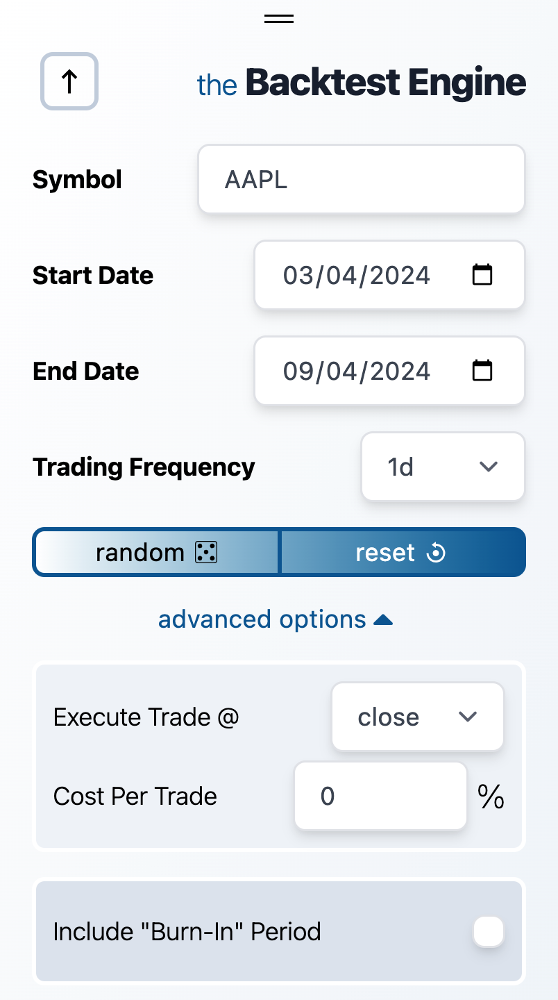
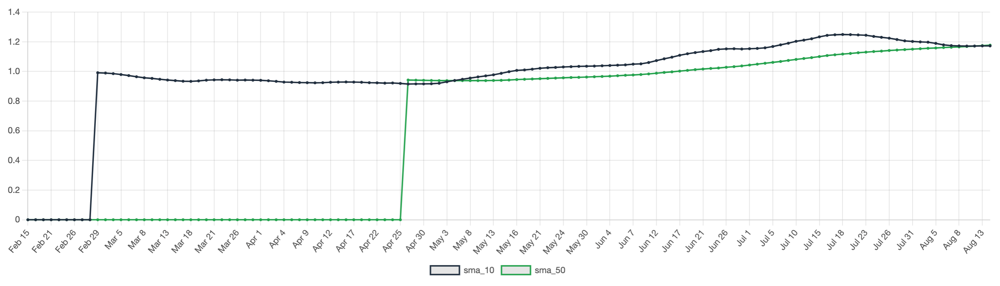
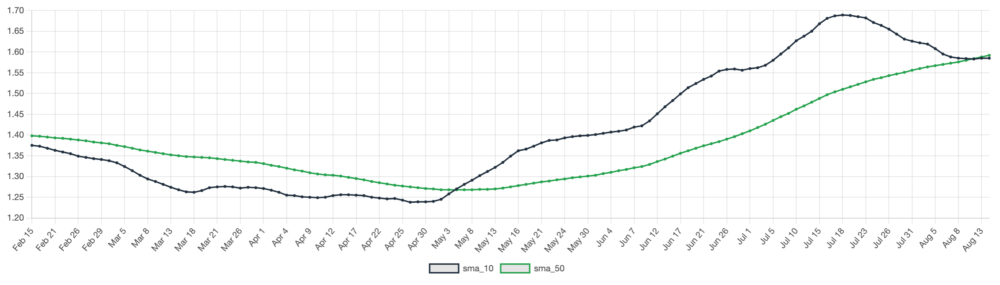

Click the `advanced options` dropdown to reveal 3 additional customization options.

### 1. Execute Trade @

Select from `high`, `low`, `open`, or `close` to specify the time you want to execute trades, corresponding to the data column used in your backtest.

For instance, choosing `open` means your strategy is backtested against the stock's opening prices, simulating a trade just after 9:30 AM, should you be trading on a daily interval. By default, `close` is used.

:::danger
Avoid using `high` or `low` for backtesting, as these introduce bias. At the time of the test, you wouldn't know the exact high or low for that period. Also be careful not to accidentally use the `close` price as a factor in deciding the trading signal at `open`.
:::

### 2. Cost Per Trade

This option defines the cost per trade, applied on both **buys** and **sells**. The cost is calculated as a percentage of the trade value. While it may seem insignificant, for high-frequency strategies, trading costs can significantly impact overall performance.

### 3. Burn-in Period

For strategies relying on historical data (e.g., using a 50-day moving average), you can define a burn-in period, allowing the strategy to “warm up” before the first trade. This ensures the strategy has enough data to generate signals from the start.

> **Example**:  
> If your strategy uses a 50-day moving average, set the burn-in period to _at least_ 50 business days before your selected start date. This gives the strategy time to develop valid signals before the first trading day.
> Without using a burn-in period, your moving average may look like this:
> 
> Add a ~50 day burn-in period, and you can see we've eliminated the 50-day initialization period:
> 