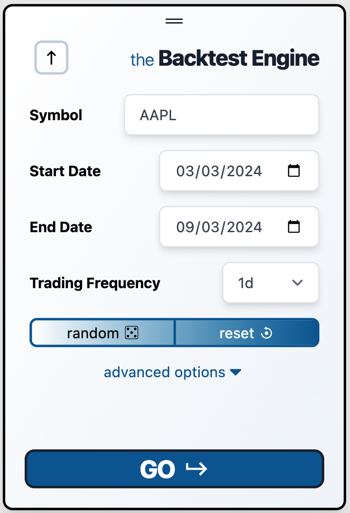

### Mandatory Options

To run a backtest, you must specify 4 mandatory options:

#### 1. Symbol

Choose the stock you want to backtest. We support the ~10,000 most popular stocks.

:::caution
Ensure the stock has been publicly listed during your chosen date range. If you select a stock that went bankrupt before the start date, you will encounter an error when attempting to fetch data or run the test.
:::

#### 2. Start Date

Select the date/time for the backtest to begin. Your first data point will be **after** this date, not on it (i.e., the start date is exclusive).

#### 3. End Date

Choose when you'd like to stop the backtest, exit all positions, and view the results.

#### 4. Trading Frequency

Set how often you want to execute trades, within market hours.

---

### Random Button

If you want a random S&P 500 stock and a random start/end date ranging from 1 month to 2 years apart, click this button.

:::caution
Be aware that errors may arise if the random time interval doesn’t align with the company's lifetime.
:::

### Reset Button

Press the reset button to return to the default backtest settings:

- **Symbol:** AAPL  
- **Start Date:** 12 months ago  
- **End Date:** 6 months ago  
- **Trading Frequency:** 1 day  

### Have Fun.

Run your strategies and watch the results/metrics pour in!
