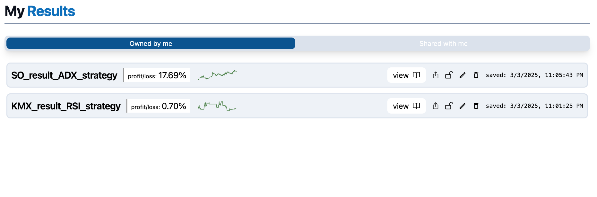

### Happy With Your Result?

Congratulations on running a successful backtest! 

Don't forget to **name** and **save** your result for future use. It will appear on your results page:

### What Can I Do with a Saved Result?

#### 1. Share

You can share your strategy with other users if they have an account with us! Once shared, your strategy will appear in their 'Shared with Me' section on the results page. They’ll need to accept the strategy before being able to view it.

#### 2. Lock/Unlock

Control whether your strategy appears on the global leaderboard. Don't worry, even public strategies won’t expose your code or inner workings!

#### 3. Rename

Rename your strategy. If you’ve shared it, the new name will reflect for all users.

#### 4. Delete

You can delete your result at any time.

:::caution
If you’ve shared the strategy, deleting it will also remove it from the accounts of anyone you’ve shared it with.
:::
